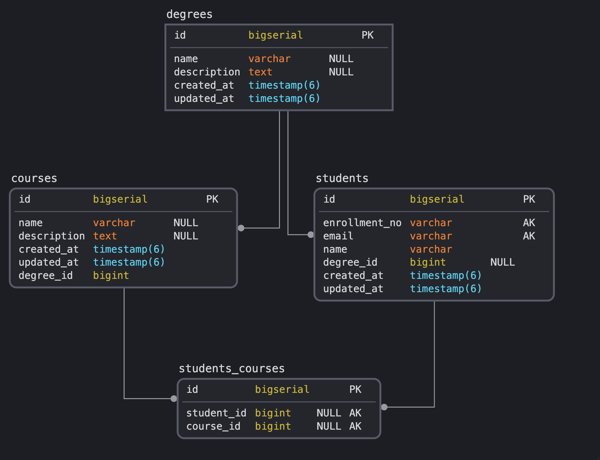

# Student Registration Platform

Live at http://ec2-15-206-82-30.ap-south-1.compute.amazonaws.com
#### Database Schema



<ul>
<li>Degree Model captures all the degrees offered to a students</li>
<li>Courses Model captures all the courses offered to a students every course belongs to a degree</li>
<li>Students Model captures all the information about a student, each student must belong to a course and every student can be enrolled to multiple courses</li>
<li>Students courses is join table maintaining many to many relation between students and courses</li>
</ul>

#### Model Validations

<ul>
<li>Student's email must follow standard email pattern.</li>
<li>Student's name must be of length greater than or equal to 3.</li>
<li>Every Student must belong to a Degree.</li>
<li>Every course enrolled by a student must be offered by the degree he/she is enrolled for.</li>
</ul>

#### Endpoints available

```
GET /v1/students  ->  fetches all the Students
GET /v1/degrees   ->  fetches all the Degrees offered
GET /v1/degrees/:degree_id   ->  fetches a degree as given by degree_id
GET /v1/degrees/:degree_id/courses   ->   fetches all the courses offered by a degree
GET /v1/degrees/:degree_id/courses/:course_id  ->  fetches a course provided by a degree offered
POST /v1/students   ->   add a new student attributes passed as request body
DELETE /v1/students/:student_id   ->   delete a student provided by student id
PUT /v1/students/:student_id   ->   update a student's attributes
```

#### Deploy Strategy

<ul>
<li>Student Registration Platform is being served by nginx web server</li>
<li>All the static files are served at location '/'</li>
<li>All the requests prefixed with /api are proxied to student-registration-platform-api service</li>
<li>Database used is Postgres and is running as a docker container along with rails and nginx service</li>
</ul>


#### Local setup

Clone the project
```
$ git clone https://github.com/sreekar2307/student-registration-platform-api.git
$ cd student-registration-platform-api
$ git submodule init
$ git submodule update
```
Create a .env file with the below contents in projects root directory
```
nginx_host_port=8080
database_name=student-registration-platform-development
database_username=user
database_password=password
rails_env=development
```
Run Docker compose
`docker-compose up --build -d`


